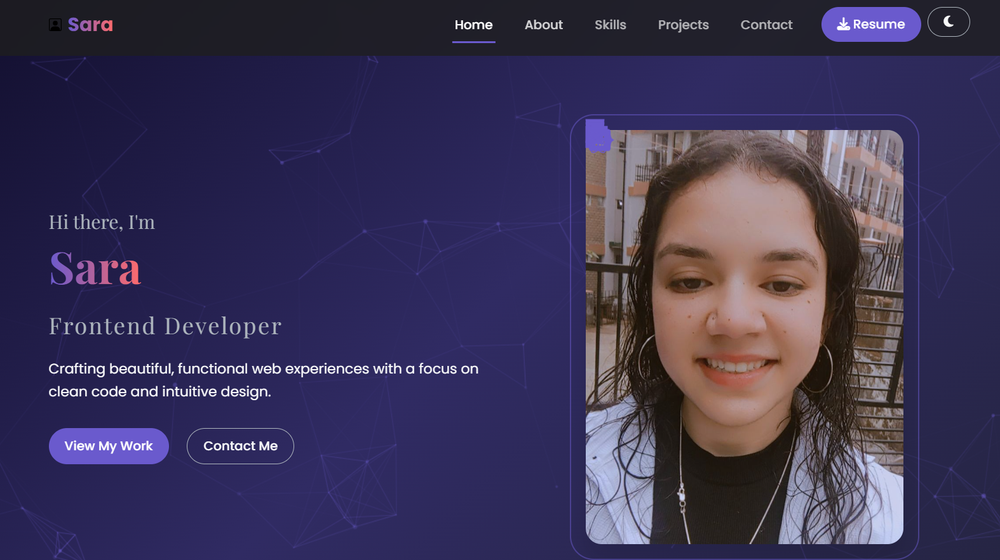

# ⚡ Sara's Portfolio Website



Welcome! I’m **Sara**, an aspiring software engineer passionate about building clean, responsive, and engaging user interfaces. This is my personal portfolio website — crafted to highlight my skills, showcase my projects, and tell my story as a developer.

## 🔗 Live Demo
👉 [View Live Site](https://portfolio-website-4t3srbhaf-saras-projects-95e4769b.vercel.app/)

---

## 🚀 Key Features

- **Modern UI/UX Design** – Clean, professional layout with smooth interactions
- **Typewriter Hero Text** – Dynamic introduction in the hero section
- **Animated Skill Progress Bars** – Visual representation of technical skills
- **Project Filtering System** – Filter projects by category (e.g., Frontend, JavaScript)
- **Responsive Design** – Optimized for all devices, from mobile to desktop
- **Particle.js Background** – Dynamic animated particle background
- **Contact Form** – Basic form setup (logs to console for now)
- **Dark/Light Mode Toggle** – User preference stored using `localStorage`

---

## 🛠 Technologies Used

### 💻 Frontend
- **HTML5**, **CSS3**, **JavaScript**
- **Bootstrap 5** – For responsive layout and components
- **jQuery** – For DOM interactions and animations
- **Particles.js** – For animated background effects
- **Animate.css** – For entry and scroll animations
- **Font Awesome** – For iconography
- **Google Fonts** – For clean and modern typography

### 🚀 Deployment
- **Vercel** – For fast and seamless hosting
- **Git & GitHub** – Version control and collaboration

---

## 🎨 UI/UX Highlights

- 🔁 Smooth transitions and entrance animations throughout
- 🌗 Dark/Light mode toggle with persistent state
- 📊 Progress bars for core skills like HTML, CSS, JavaScript, and Bootstrap
- 🧩 Filterable project cards for easy navigation
- 📱 Mobile-friendly navbar with toggle menu

---

## 🔧 Getting Started

1. **Clone the Repository**
   ```bash
   git clone https://github.com/sara-1129/Portfolio-Website.git
   cd Portfolio-Website

## 📈 Future Enhancements

- Backend integration for the contact form  
- Dedicated blog section for sharing insights  
- Testimonials carousel  
- Project video previews  
- Enhanced accessibility features  

---

## 🤝 Contributions

Contributions are welcome!  
Feel free to **fork** the project, submit **pull requests**, or **open issues** for suggestions and improvements.

---

## 📜 License

This project is licensed under the **MIT License** —  
Free to use, modify, and share with proper attribution.
